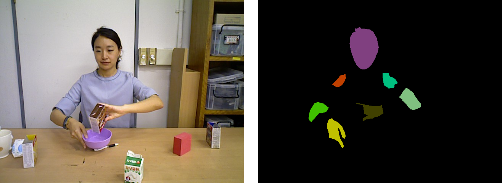

# Urobot_segmentation_DB

Urobot_segmentation_DB is a segmentation datasets for human upper-body with 7 joints; head, left shoulder, left elbow, left hand, right shoulder, right elbow, and right hand.

This dataset consists of RGB and segmentation images that depict 12 different scenarios, such as cleaning the table, preparing cereal in a bowl, reading a book, etc., with four different persons. 


 


Classes are mapped to numerical IDs as follows:
```
#0:   Background                     ColorRGB (0,0,0)
#1:   Head                           ColorRGB (128,64,128)
#2:   Left shoulder                  ColorRGB (0,192,128)
#3:   Left elbow                     ColorRGB (128,192,128,)
#4:   Left hand                      ColorRGB (64,64,0)
#5:   Right shoulder                 ColorRGB (192,64,0,)
#6:   Right elbow                    ColorRGB (64,192,0)
#7:   Right hand                     ColorRGB (192,192,0)
```


## Download the data
- [RGB images](https://drive.google.com/open?id=12za3F-GqXGXVYkHGrbbK8NdaNLUow3pi)
- [Segmentation images](https://drive.google.com/open?id=1RL_LDZckXLKA27EcyHfOopmZzT0jNMxB)
- [Class labels(txt)](https://drive.google.com/open?id=1wVE1qkP_h2pYVpvMBtOwP-GbEsFz0uTE) and [class color descriptions(txt)](https://drive.google.com/open?id=12Bogj36gLoIyWfEr_Cp9-Nl1ZChlsItK)


### Citations
If you use the Urobot_segmentation_DB in your work, please cite these papers in your publication:

Seunghee Lee, Jungmo Koo, Hyungjin Kim, Kwangyik Jung, and Hyun Myung, "A Robust Estimation of 2D Human Upper-body Poses using Fully Convolutional Network," in Proc. Int'l Conf. on Robot Intelligence Technology and Applications (RiTA), Daejeon, Korea, Dec. 13 - 15, 2017. 


    @inproceedings{Lee2017Robust,
      author = {Seunghee Lee, Jungmo Koo, Hyungjin Kim, Kwangyik Jung and Hyun Myung},
      booktitle = {RiTA},
      title = {A Robust Estimation of 2D Human Upper-body Poses using Fully Convolutional Network},
      year = {2017}
    }

